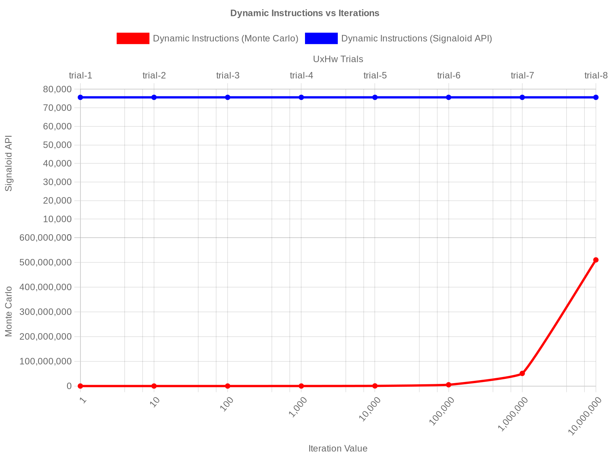
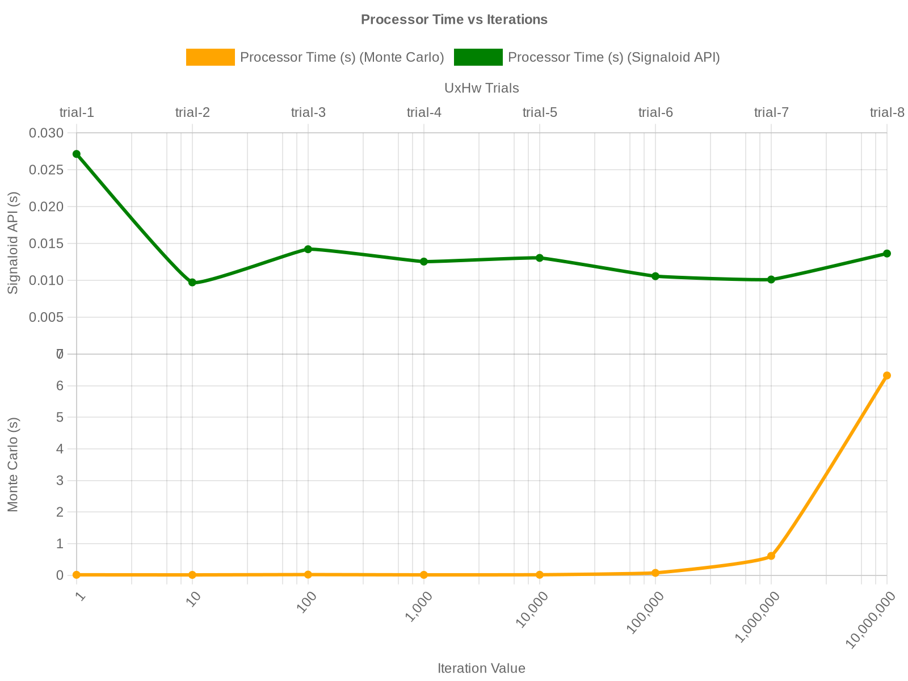
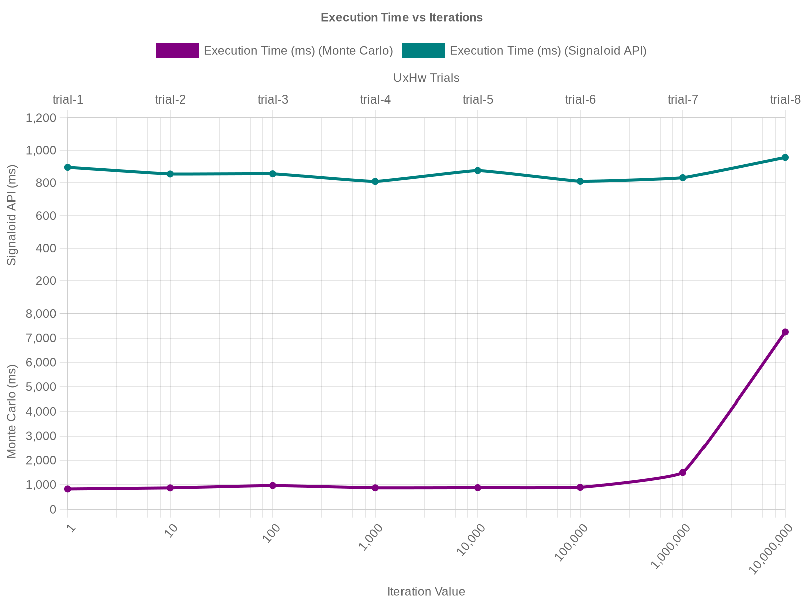
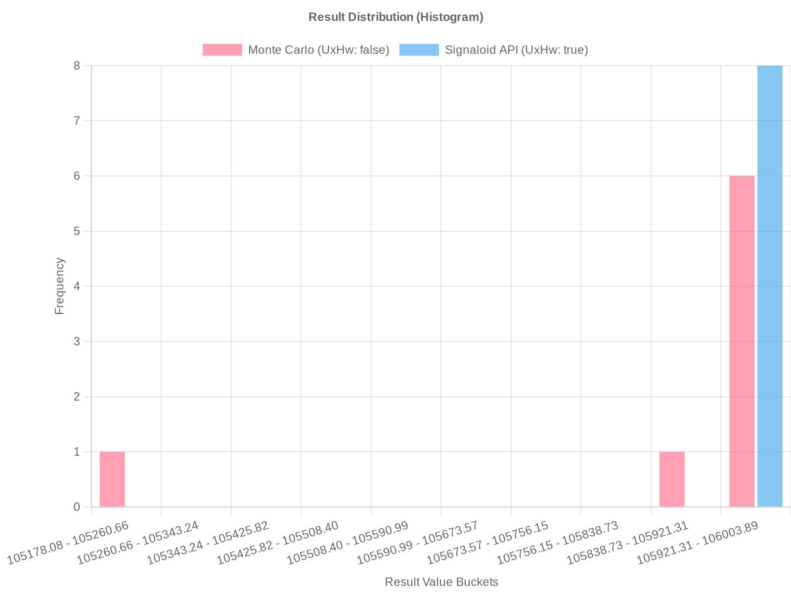

# Introduction 

This repository features a GitHub Actions workflow that executes both the Monte Carlo and UxHw C programs, fetches their execution statistics, generates performance comparison table and plots, and commits the results back to this repository.

 [**Read the GitHub Actions Pipeline Documentation here**](https://github.com/LikhithST/signaloid-performance-benchmark/blob/main/.github/workflows/README.md) for details on how to configure and trigger the automated pipeline.

# Table of Contents
1. [Performance Benchmarking](#performance-benchmarking-monte-carlo-vs-signaloid-uxhw)
    - [Performance Comparison Table](#performance-comparison-table)
    - [Signaloid Execution Plots](#signaloid-execution-plots)
    - [Key Findings](#key-findings)
2. [Prerequisites](#prerequisites)
3. [Code execution on signaloid platform](#code-execution-on-signaloid-platform)
    - [Signaloid API Demonstration Script Template](#signaloid-api-demonstration-script-template)
    - [Create scripts using example script template](#create-scripts-using-example-script-template)
4. [Usage](#usage)
5. [Output](#output)


# Performance Benchmarking: Monte Carlo vs. Signaloid UxHw

## Performance Comparison Table

<!-- TABLE_START -->
| Method | Iterations | Dynamic Instructions | Processor Time (s) | Execution Time (ms) | Result |
| :--- | :--- | :--- | :--- | :--- | :--- |
| Monte Carlo | 1 | 69,090 | 0.0150 | 827 | 105,178.08 |
| Monte Carlo | 10 | 67,704 | 0.0123 | 871 | 105,840.41 |
| Monte Carlo | 100 | 73,903 | 0.0215 | 968 | 105,981.34 |
| Monte Carlo | 1,000 | 121,224 | 0.0133 | 873 | 105,969.79 |
| Monte Carlo | 10,000 | 577,057 | 0.0162 | 879 | 106,003.89 |
| Monte Carlo | 100,000 | 5,168,627 | 0.0758 | 894 | 105,998.11 |
| Monte Carlo | 1,000,000 | 51,069,185 | 0.6131 | 1,504 | 105,999.47 |
| Monte Carlo | 10,000,000 | 510,069,334 | 6.3250 | 7,253 | 105,999.81 |
| **UxHw (Avg)** | **N/A** | **~75,652** | **~0.0139** | **~861** | **106,000.00** |
<!-- TABLE_END -->

## Signaloid Execution Plots

The performance metrics gathered by the automation scripts are visualized below:

The generated plots include:
1. **`instrChart.png`**: A line graph comparing Dynamic Instructions against the number of mathematical iterations for both models.
2. **`processorTimeChart.png`**: A line graph comparing the Processor Execution Time (in seconds) between standard Monte Carlo and Signaloid UxHw.
3. **`execTimeChart.png`**: A line graph comparing the total Execution Time (in milliseconds) required to complete the tasks.
4. **`distChart.png`**: A clustered histogram showing the probability density distribution of the portfolio value calculation outputs.

<!-- PLOTS_START -->







<!-- PLOTS_END -->

## Key Findings

1. **Computational Cost:** The Monte Carlo method exhibits linear growth in `ProcessorTime` as iteration count ($N$) increases, adhering to $O(N)$ complexity.
2. **Deterministic Efficiency:** The Signaloid UxHw approach decouples computational complexity from iteration count, enabling constant-time $O(1)$ risk analysis.
3. **Precision:** Monte Carlo results represent statistical point estimates that converge slowly, whereas Signaloid provides the analytical distribution, offering higher fidelity for tail-risk modeling.

<!-- --- -->

# Prerequisites

To run these scripts, you need the following installed on your system:
- `curl` (for making HTTP requests to the API)
- `python3` (used as a lightweight JSON parser in the scripts)
- A valid Signaloid API Key.

# Code execution on signaloid platform

Signaloid API execution flow is as follows:
1. **Submit Build**: Uploads the embedded C code payload to be compiled.
2. **Poll Build Status**: Waits until the build is `Completed`.
3. **Submit Task**: Executes the compiled binary on a specified Signaloid Core (`CoreID`).
4. **Poll Task Status**: Waits until the execution is `Completed`.
5. **Retrieve Execution Statistics**: Fetches and displays statistics about the task execution, such as duration.
6. **Retrieve Output**: Fetches and displays the standard output (stdout) from the executed task.

## Signaloid API Demonstration Script Template:
```bash
#!/bin/bash

# Configuration
# Replace with your actual Signaloid API Key
# API_KEY="YOUR_SIGNALOID_API_KEY"
CORE_ID="cor_b21e4de9927158c1a5b603c2affb8a09" # using C0-S+
BASE_URL="https://api.signaloid.io"

# Helper function to extract JSON values using python3
parse_json() {
python3 -c "import sys, json; print(json.load(sys.stdin)['$1'])"
}

echo "--- 1. Submitting Build ---"
BUILD_RESPONSE=$(curl -s -X POST "$BASE_URL/sourcecode/builds" \
-H "Authorization: $API_KEY" \
-H "Content-Type: application/json" \
-d "{
\"Code\": \"<Code_with_or_without_uxhw.h>\",
\"Language\": \"C\",
\"CoreID\": \"$CORE_ID\"
}")

BUILD_ID=$(echo "$BUILD_RESPONSE" | parse_json "BuildID")
echo "Build ID: $BUILD_ID"

# Poll Build Status
echo "--- 2. Polling Build Status ---"
while true; do
BUILD_STATUS_RESPONSE=$(curl -s -H "Authorization: $API_KEY" "$BASE_URL/builds/$BUILD_ID")
STATUS=$(echo "$BUILD_STATUS_RESPONSE" | parse_json "Status")
echo "Current Status: $STATUS"

if [ "$STATUS" == "Completed" ]; then
break
elif [ "$STATUS" == "Cancelled" ] || [ "$STATUS" == "Stopped" ]; then
echo "Build terminal state reached: $STATUS"
exit 1
fi
sleep 2
done

# Execute Task
echo "--- 3. Submitting Task ---"
TASK_RESPONSE=$(curl -s -X POST "$BASE_URL/builds/$BUILD_ID/tasks" \
-H "Authorization: $API_KEY")
TASK_ID=$(echo "$TASK_RESPONSE" | parse_json "TaskID")
echo "Task ID: $TASK_ID"

# Poll Task Status
echo "--- 4. Polling Task Status ---"
while true; do
TASK_STATUS_RESPONSE=$(curl -s -H "Authorization: $API_KEY" "$BASE_URL/tasks/$TASK_ID")
STATUS=$(echo "$TASK_STATUS_RESPONSE" | parse_json "Status")
echo "Current Status: $STATUS"

if [ "$STATUS" == "Completed" ]; then
break
elif [ "$STATUS" == "Cancelled" ] || [ "$STATUS" == "Stopped" ]; then
echo "Task terminal state reached: $STATUS"
exit 1
fi
sleep 2
done

# Fetch Execution Stats
echo "--- 5. Fetching Execution Stats ---"
# The TASK_STATUS_RESPONSE from the last poll already contains the completed task details
EXECUTION_STATS=$(echo "$TASK_STATUS_RESPONSE" | python3 -c "import sys, json; print(json.dumps(json.load(sys.stdin).get('Stats', {}), indent=2))")
echo "Execution Statistics:"
echo "$EXECUTION_STATS"

# Fetch Outputs
echo "--- 6. Retrieving Output ---"
OUTPUT_RESPONSE=$(curl -s -H "Authorization: $API_KEY" "$BASE_URL/tasks/$TASK_ID/outputs")
OUTPUT_URL=$(echo "$OUTPUT_RESPONSE" | parse_json "Stdout")

echo "Resulting Output:"
curl -s "$OUTPUT_URL"
echo ""
```

<!-- --- -->

## Create scripts using example script template

### 1. `run_signaloid_pipe_with_uxhw.sh`
This script submits a C program that leverages Signaloid's Uncertainty API (`uxhw.h`).
- Instead of looping through thousands of possibilities, it defines the daily return as an uncertain uniform distribution (`UxHwDoubleUniformDist(0.05, 0.07)`).

- The output is the entire probability distribution of the final portfolio value, calculated in a single pass without loops.

**C Code Snippet to be used in [example script](#signaloid-API-Demonstration-Script-Template):**
```c
#include <stdio.h>
#include <uxhw.h>

int main() {
double principal = 100000.0;

// We define the market return as a known distribution of possibilities.
// The hardware will propagate this uncertainty through the formula.
double daily_return = UxHwDoubleUniformDist(0.05, 0.07);

// One single calculation, zero loops.
double final_value = principal * (1 + daily_return);

// The output is the entire probability distribution of the result.
printf("Portfolio outcome distribution: %lf\n", final_value);

return 0;
}
```

### 2. `run_signaloid_pipe_without_uxhw.sh`
This script submits a traditional C program that relies on a standard Monte Carlo simulation.
- It uses the standard library (`rand()`) and loops 10,000 times to simulate different possible daily returns between 5% and 7%.
- The results are averaged to provide a projected average portfolio value.
- This serves as a baseline to compare against Signaloid's automated uncertainty-tracking capabilities.

**C Code Snippet to be used in [example script](#signaloid-API-Demonstration-Script-Template):**
```c
#include <stdio.h>
#include <stdlib.h>
#include <time.h>

int main() {
double min = 0.05;
double max = 0.07;
int iterations = 10000;
double principal = 100000.0;
double sum_results = 0;

srand(time(NULL));

for (int i = 0; i < iterations; i++) {
double daily_return = min + ((double)rand() / (double)RAND_MAX) * (max - min);
double final_value = principal * (1 + daily_return);
sum_results += final_value;
}

printf("Projected Average Portfolio Value: %.2f\n", sum_results / iterations);
return 0;
}
```

# Usage

1. Make sure the scripts are executable:
```bash
chmod +x run_signaloid_pipe_with_uxhw.sh
chmod +x run_signaloid_pipe_without_uxhw.sh
```

2. Set your Signaloid API Key as an environment variable. The scripts read the `$API_KEY` variable from your environment:
```bash
export API_KEY="your_actual_api_key_here"
```

3. Run the scripts:
```bash
./run_signaloid_pipe_with_uxhw.sh
./run_signaloid_pipe_without_uxhw.sh
```

# Output
```bash
$ ./run_signaloid_pipe_with_uxhw.sh
--- 1. Submitting Build ---
Build ID: bld_df336d629a4a43b0840f4a3a59103d07
--- 2. Polling Build Status ---
Current Status: Completed
--- 3. Submitting Task ---
Task ID: tsk_cf7bd4779d5a4dd3b012f12c9d94a13b
--- 4. Polling Task Status ---
Current Status: Completed
--- 5. Fetching Execution Stats ---
Execution Statistics:
{
"DynamicInstructions": 75984,
"ProcessorTime": 0.013747,
"ExecutionTimeInMilliseconds": 882
}
--- 6. Retrieving Output ---
Resulting Output:
Portfolio outcome distribution: 106000.000000Ux04000000000000000140F9E100000000000000004040F9A379FFFFFFFF020000000000000040F9A56E00000000020000000000000040F9A76200000000020000000000000040F9A95600000000020000000000000040F9AB4A00000001020000000000000040F9AD3E00000000020000000000000040F9AF3200000000020000000000000040F9B125FFFFFFFF020000000000000040F9B31A00000000020000000000000040F9B50E00000000020000000000000040F9B70200000000020000000000000040F9B8F600000001020000000000000040F9BAEA00000000020000000000000040F9BCDE00000000020000000000000040F9BED1FFFFFFFF020000000000000040F9C0C600000001020000000000000040F9C2BA00000000020000000000000040F9C4AE00000000020000000000000040F9C6A1FFFFFFFF020000000000000040F9C89600000000020000000000000040F9CA8A00000000020000000000000040F9CC7E00000000020000000000000040F9CE7200000001020000000000000040F9D06600000000020000000000000040F9D25A00000000020000000000000040F9D44DFFFFFFFF020000000000000040F9D64200000000020000000000000040F9D83600000000020000000000000040F9DA2A00000000020000000000000040F9DC1E00000001020000000000000040F9DE1200000000020000000000000040F9E00600000000020000000000000040F9E1F9FFFFFFFF020000000000000040F9E3EE00000000020000000000000040F9E5E200000000020000000000000040F9E7D600000000020000000000000040F9E9CA00000001020000000000000040F9EBBE00000000020000000000000040F9EDB200000000020000000000000040F9EFA5FFFFFFFF020000000000000040F9F19A00000001020000000000000040F9F38E00000000020000000000000040F9F58200000000020000000000000040F9F775FFFFFFFF020000000000000040F9F96A00000000020000000000000040F9FB5E00000000020000000000000040F9FD5200000000020000000000000040F9FF4600000001020000000000000040FA013A00000000020000000000000040FA032E00000000020000000000000040FA0521FFFFFFFF020000000000000040FA071600000000020000000000000040FA090A00000000020000000000000040FA0AFE00000000020000000000000040FA0CF200000001020000000000000040FA0EE600000000020000000000000040FA10DA00000000020000000000000040FA12CDFFFFFFFF020000000000000040FA14C200000000020000000000000040FA16B600000000020000000000000040FA18AA00000000020000000000000040FA1A9E00000001020000000000000040FA1C9200000000020000000000000040FA1E86000000000200000000000000
```
---